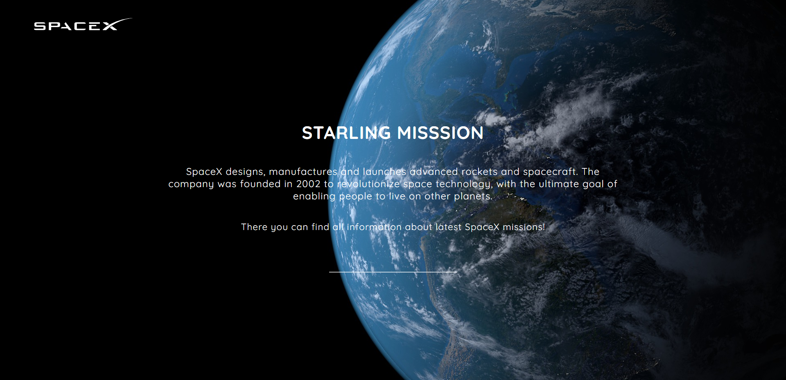
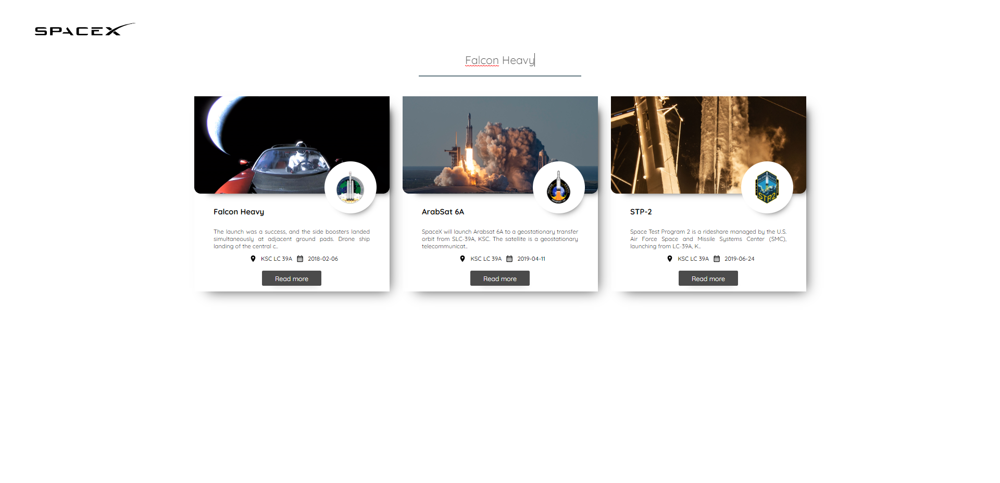
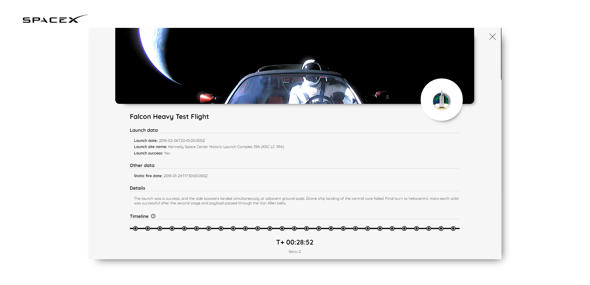

# vue-shop
>This repository contains application code that collects data about space missions carried out by SpaceX.

## Open Spacex Missions API
[https://github.com/r-spacex/SpaceX-API](https://github.com/r-spacex/SpaceX-API)

## Screenshots from website

### Homepage

### Results

### Modal panel


## Project setup
```
npm install
```

### Compiles and hot-reloads for development
```
npm run serve
```

### Compiles and minifies for production
```
npm run build
```

### Run your unit tests
```
npm run test:unit
```

### Lints and fixes files
```
npm run lint
```

## Contact
Created by [@PJasiczek](http://www.piotrjasiczek.pl/) - feel free to contact me!
